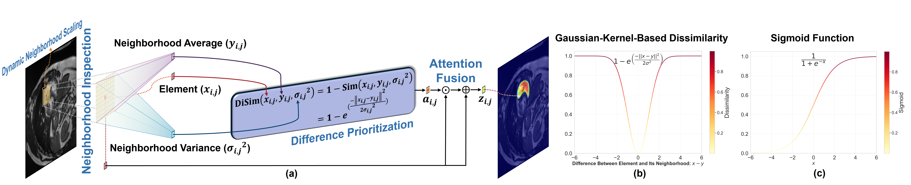

# Neighborhood Self-Dissimilarity Attention for Medical Image Segmentation
[](https://opensource.org/licenses/MIT) 

✨ This paper has been accepted at `NeurIPS 2025` as a `spotlight` (3% of submissions).  

There were 21575 valid paper submissions to the NeurIPS Main Track this year, of which the program committee accepted 5290 (24.52%) papers in total, with breakdown of 4525 as posters, 688 as spotlight and 77 as oral.

🔥 Our [TinyU-Net: Lighter Yet Better U-Net with Cascaded Multi-receptive Fields](https://doi.org/10.1007/978-3-031-72114-4_60) [[Official Implementation](https://doi.org/10.1007/978-3-031-72114-4_60)]  has been published at `MICCAI 2024` as an `ORAL` (2.7% of submissions).

## BibTex
```bibtex
@InProceedings{Chen_TinyUNet_MICCAI2024,
        author    = {Chen, Junren and Chen, Rui and Wang, Wei and Cheng, Junlong and Liang, Gang and Zhang, Lei and Chen, Liangyin},
        title     = {Neighborhood Self-Dissimilarity Attention for Medical Image Segmentation},
        year      = {2025},
        # todo: add booktitle, publisher, volume, month, pages
}

@InProceedings{Chen_TinyUNet_MICCAI2024,
        author    = {Chen, Junren and Chen, Rui and Wang, Wei and Cheng, Junlong and Zhang, Lei and Chen, Liangyin},
        title     = {TinyU-Net: Lighter Yet Better U-Net with Cascaded Multi-receptive Fields},
        booktitle = {Medical Image Computing and Computer Assisted Intervention -- MICCAI 2024},
        year      = {2024},
        publisher = {Springer Nature Switzerland},
        volume    = {LNCS 15009},
        month     = {October},
        pages     = {626--635}
}
```


## Methodology

The overview of our parameter-free Neighborhood Self-Dissimilarity Attention (NSDA).  
- (a) The illustrating of the NSDA architecture for every element, which uses the proposed Gaussian-kernel-based method to measure element-neighborhood dissimilarity, giving higher weights to elements with more salient differences. 
- (b) The dissimilarity-driven weighting curve generated by NSDA.
- (c) The conventional sigmoid-based weighting curve employed in traditional attention mechanisms.  

Compared with traditional sigmoid-based methods, NSDA eliminates sign-induced bias, thereby ensuring equitably weighted contributions from features with opposing polarity.

## Usage of NSDA
```python
import torch
from NSDA import NSDA

input      = torch.randn(8, 16, 64, 64)
b, c, h, w = input.shape

# NSDA withou Dynamic Neighborhood Scaling (DyNS)
attention  = NSDA(in_channels=c, out_channels=c)
output1    = attention(input)

# DyNS-equipped NSDA
if (h//8)%2 == 0:
    output2 = NSDA(in_channels=c, out_channels=c, window_size=(h//8+1, w//8+1))(input)
else:
    output2 = NSDA(in_channels=c, out_channels=c, window_size=(h//8+2, w//8+2))(input)
```
See `NSDA.py` for specific usage.

## NSDA-augmented Networks
We integrate NSDA on four established neural networks for medical image segmentation:
- U-Net: The code is available at `NSDA-augmented Networks/NSDA-augmented-UNet.py`.
- TransUNet: The code is available at `NSDA-augmented Networks/NSDA-augmented-TransUNet/NSDA-augmented-TransUNett.py`. It script requires the following Python files as dependencies: 
    - vit_seg_configs.py
    - vit_seg_modeling.py       
    - vit_seg_modeling_resnet_skip.py  
- UNeXt: The code is available at `NSDA-augmented Networks/NSDA-augmented-UNeXt.py`.
- TinyU-Net: The code is available at `NSDA-augmented Networks/NSDA-augmented-TinyUNet.py`.

## Qualitative Results

Qualitative results across various benchmarks. 
- Odd rows:  Grad-CAM visualizations of attention-integrated U-Nets for segmenting the pancreas (Synapse), right ventricle (ACDC), and benign tumors (BUSI).  Warmer colors (e.g., red) indicate higher attention weights.
- Even rows: segmentation outcomes of attention-integrated U-Nets. 

Our NSDA helps U-Net to delineate Regions of Interest (ROIs) more precisely.
